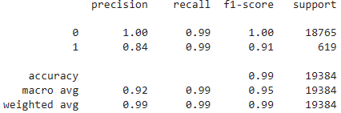

# credit-risk-classification

    <!--Student View-->
    

      

        <h1 class="title">
          Module 20 Challenge
        </h1>
      

  

    <h3>Instructions</h3>
    
The instructions for this Challenge are divided into the following subsections:

    <ul>
        <li>
            
Split the Data into Training and Testing Sets

        </li>
        <li>
            
Create a Logistic Regression Model with the Original Data

        </li>
        <li>
            
Write a Credit Risk Analysis Report

        </li>
    </ul>
    <h4>Split the Data into Training and Testing Sets</h4>
    
Open the starter code notebook and use it to complete the following steps:

    <ol>
        <li>
            
Read the <code>lending_data.csv</code> data from the Resources folder into a Pandas DataFrame.

        </li>
        <li>
            
Create the labels set (<code>y</code>) from the “loan_status” column, and then create the features (<code>X</code>) DataFrame from the remaining columns.

            
<strong class="blockquote-title">note</strong>

                
A value of 0 in the “loan_status” column means that the loan is healthy. A value of 1 means that the loan has a high risk of defaulting.

            

        </li>
        <li>
            
Split the data into training and testing datasets by using <code>train_test_split</code>.

        </li>
    </ol>
    <h4>Create a Logistic Regression Model with the Original Data</h4>
    
Use your knowledge of logistic regression to complete the following steps:

    <ol>
        <li>
            
Fit a logistic regression model by using the training data (<code>X_train</code> and <code>y_train</code>).

        </li>
        <li>
            
Save the predictions for the testing data labels by using the testing feature data (<code>X_test</code>) and the fitted model.

        </li>
        <li>
            
Evaluate the model’s performance by doing the following:

            <ul>
                <li>
                    
Generate a confusion matrix.

                </li>
                <li>
                    
Print the classification report.

                </li>
            </ul>
        </li>
        <li>
            
Answer the following question: How well does the logistic regression model predict both the 0 (healthy loan) and 1 (high-risk loan) labels?

        </li>
    </ol>
    <h4>Write a Credit Risk Analysis Report</h4>
    
Write a brief report that includes a summary and analysis of the performance of the machine learning models that you used in this homework. You should write this report as the <code>README.md</code> file included in your GitHub repository.

    
Structure your report by using the report template that <code>Starter_Code.zip</code> includes, ensuring that it contains the following:

    <ol>
        <li>
            
<strong>An overview of the analysis:</strong> Explain the purpose of this analysis.

        </li>
        <li>
            
<strong>The results:</strong> Using a bulleted list, describe the accuracy score, the precision score, and recall score of the machine learning model.

        </li>
        <li>
            
<strong>A summary:</strong> Summarize the results from the machine learning model. Include your justification for recommending the model for use by the company. If you don’t recommend the model, justify your reasoning.

        </li>
    </ol>

    <h3>Overview of the Analysis:</h3>
        <ul>
            <li>
Explain the purpose of the analysis.
</li>
            <li>
Explain what financial information the data was on, and what you needed to predict.
</li>
            <li>
Provide basic information about the variables you were trying to predict (e.g., `value_counts`).
</li>
            <li>
Describe the stages of the machine learning process you went through as part of this analysis.
</li>
            <li>
Briefly touch on any methods you used (e.g., `LogisticRegression`, or any resampling method).
</li>
        </ul>
    <h3>Results</h3>
    <h4>Machine Learning Model 1 (Healthy loans=0, high-risk loans=1):</h4>
        <li>Model 1 Overall Accuracy 99%</li>
        <li>Model 1 balanced accuracy score 0.95% (0.9520479254722232).</li>
        <li>Model 1 Precision 100% for healthy loans and 85% for high-risk loans.</li>
        <li>Model 1 Recall 99% for healthy loans and 91% for high-risk loans</li>
        <li>Model 1 f1-score 100% for healthy loans and 88% for high-risk loans</li>
        
    <h4>Machine Learning Model 2 (Healthy loans=0, high-risk loans=1):</h4>
        <li>Model 2 Overall Accuracy 99%</li>
        <li>Model 2 balanced accuracy score 0.99% (0.9936781215845847).</li>
        <li>Model 2 Precision 100% for healthy loans and 84% for high-risk loans.</li>
        <li>Model 2 Recall 99% for healthy loans and also 99% for high-risk loans</li>
        <li>Model 1 f1-score 100% for healthy loans and 91% for high-risk loans</li>
        
    <h3>Summary</h3>
        <li>* The First model for the low risk loans has an accuracy of 100%, the recall is 99% which is excellent, however with the 1 label for the high-risk loans, the precision is 85% and the  recall is 91%.  85% precision is low for high-risk loans in my opinion, also the recall tells us about how the model identifies true positives and 91% is not too bad but it all depends of the level of risk the business should keep to be profitable and to have less liabilities given that it is higher-risk loans. Of course we would need to verify the results to have a better perspective.  * The second model performed a bit better than model 1 with healthy loans accuracy of 99% and a recall of 99% (true positive score), as well as a f1-score that if our data contains the total number of observations the calculation function of precision and recall (F1 Score = 2* Precision Score * Recall Score/ (Precision Score + Recall Score/)), this calculation returned 100%. I think this is also a good model for our data if we were only working with healthy loans. For the high risk loans this model did a bit better than the previous, even though the precision is one percent down, the recall and f1-score improved quite a bit. If I had to choose between the 2 models I would pick this second model. </li>
        <li>* I have to say that both models could be insufficient for the line of business and risk level since the most importan prediction would be for the high-risk loans, both have a low precision score, but again there could be other variables such as total amount of loans and the level or risk the business can take to be profitable and safe at the same time. If a choice had to be made between the the two, the second model performed better although the precision was 1 percent less, the recall and f1-score had a good improvement. </li>

